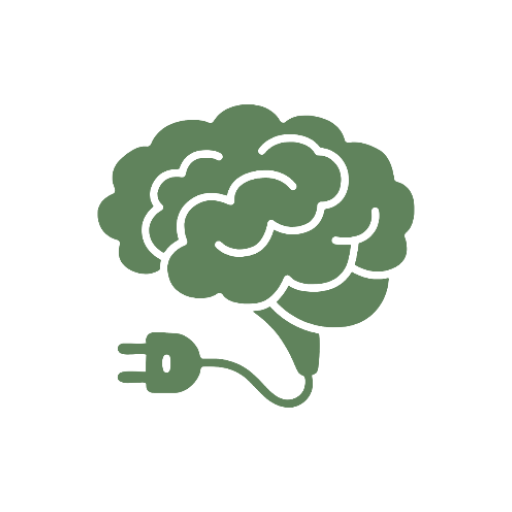
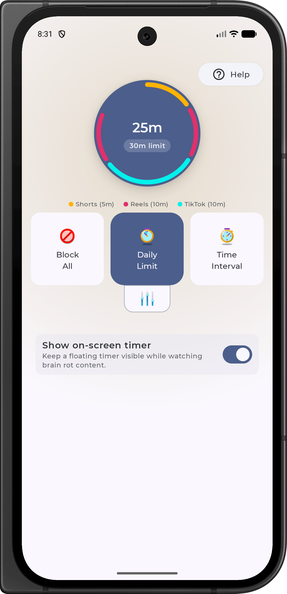

<h1 align="center">Scrolless</h1>
<h3 align="center">Anti Brain Rot App</h3>

Enhanced with Snapchat Stories blocking by Sohanuzzaman

   
  
   
  
   
   

**Scrolless** is an open-source Android application designed to help users avoid excessive consumption of brain rot by blocking distracting content like Instagram Reels, TikTok, YouTube Shorts, and Snapchat.

This enhanced version includes additional blocking support for Snapchat Stories, providing more comprehensive protection against addictive content.

Using Android's accessibility permissions, the app detects and blocks this type of content whenever it appears on the screen.
Since the app requires accessibility permissions, which can have sketchy uses, Scrolless is fully open-source.

## Features

- **Block All**  
  Instantly block access to all supported platforms, including Instagram Reels, TikTok, YouTube Shorts, Facebook Reels, Snapchat Spotlight, and Snapchat Stories.

- **Daily Limit**  
  Set a daily limit for how long you can spend on supported platforms, including Instagram Reels, TikTok, YouTube Shorts, Facebook Reels, Snapchat Spotlight, and Snapchat Stories. Once the limit is reached, access is blocked for the rest of the day.

- **Live Brain Rot Timer**  
  A real-time overlay timer tracks your session while watching Shorts or Reels, keeping you aware of your screen time.

- **Pause**   
  Pause the blocking feature for 5 minutes, allowing temporary access to the platforms.

- **Interval Timer**  
  Set intervals for usage and breaks, allowing controlled social media access throughout the day.

- **Usage Tracking**   
  Keep track of how much time you’ve spent on Instagram Reels, TikTok, YouTube Shorts, Facebook Reels, Snapchat Spotlight, and Snapchat Stories.

## Screenshots

# Architecture

Scrolless app architecture is inspired by the Google open source project [Jetcaster](https://github.com/android/compose-samples/tree/main/Jetcaster), published under the [Apache License](https://github.com/android/compose-samples/blob/main/LICENSE).

Some icons used in this app are obtained from [Icons8](https://icons8.com).

## Star History

## About This Version

This is an enhanced version of the original [Scrolless](https://github.com/duartebarbosadev/Scrolless) project by DuarteBarbosaDev. This version includes:

- **Snapchat Stories Blocking**: Additional detection and blocking for Snapchat Stories page
- **Enhanced Coverage**: More comprehensive protection against addictive Snapchat content
- **Continuous Protection**: Automatic back navigation from Stories to Camera when limits are reached

The original project remains the foundation, and this version builds upon it to provide additional features for users who need more comprehensive Snapchat blocking.
